# 🚀 Delhivery Microservice - System Design

> **Production-Ready Logistics Platform | 5,000+ Orders/Day | 99.9% Uptime**

## 📊 Project Metrics

| Metric | Value | Target |
|--------|-------|--------|
| Daily Orders | 5,000+ | ✅ Achieved |
| Uptime SLA | 99.9% | ✅ Achieved |
| Response Time (95th %ile) | <2s | ✅ Achieved |
| Cache Hit Rate | 90%+ | ✅ Achieved |
| Build Time | 8 Weeks | ✅ Achieved |

## 🏗️ System Architecture

```mermaid
graph TB
    subgraph "Client Layer"
        FE["🖥️ Frontend Client<br/>React Dashboard"]
    end

    subgraph "API Layer"
        GW["🌐 GraphQL Gateway"]
        AUTH["🔐 Authentication<br/>JWT + Redis"]
    end

    subgraph "Core Service"
        CORE["⚡ Delhivery Microservice<br/>📊 Pricing | 📦 Orders | 🚚 Tracking<br/>⚠️ NDR | 🏪 Warehouse | 🔄 Bulk Ops"]
    end

    subgraph "Internal Services"
        ACC["👥 Accounts Service"]
        SHOP["🛒 Shopify Service"]
        NDR["❌ NDR Service"]
    end

    subgraph "Data Layer"
        DB["🗄️ PostgreSQL<br/>Partitioned"]
        CACHE["⚡ Redis<br/>Multi-layer"]
        EXT["📡 Delhivery API"]
    end

    FE --> GW
    GW --> AUTH
    GW --> CORE
    AUTH --> CORE
    
    CORE --> ACC
    CORE --> SHOP
    CORE --> NDR
    
    CORE --> DB
    CORE --> CACHE
    CORE --> EXT

    classDef frontend fill:#4facfe,stroke:#333,stroke-width:2px,color:#fff
    classDef gateway fill:#43e97b,stroke:#333,stroke-width:2px,color:#fff
    classDef auth fill:#fa709a,stroke:#333,stroke-width:2px,color:#fff
    classDef core fill:#667eea,stroke:#FFD700,stroke-width:3px,color:#fff
    classDef service fill:#ffecd2,stroke:#333,stroke-width:2px,color:#333
    classDef database fill:#a8edea,stroke:#333,stroke-width:2px,color:#333

    class FE frontend
    class GW gateway
    class AUTH auth
    class CORE core
    class ACC,SHOP,NDR service
    class DB,CACHE,EXT database
```



## 🛠️ Technology Stack

<table>
<tr>
<th>Component</th>
<th>Technology</th>
<th>Reason</th>
</tr>
<tr>
<td><strong>Backend</strong></td>
<td>Go 1.21+</td>
<td>High performance, excellent gRPC support</td>
</tr>
<tr>
<td><strong>Database</strong></td>
<td>PostgreSQL 15+</td>
<td>JSONB support, partitioning, ACID compliance</td>
</tr>
<tr>
<td><strong>Cache</strong></td>
<td>Redis 7+</td>
<td>Sub-millisecond response, complex data structures</td>
</tr>
<tr>
<td><strong>Container</strong></td>
<td>Kubernetes (AKS)</td>
<td>Auto-scaling, service mesh, observability</td>
</tr>
<tr>
<td><strong>Monitoring</strong></td>
<td>Prometheus + Grafana</td>
<td>Metrics collection, visualization, alerting</td>
</tr>
<tr>
<td><strong>Communication</strong></td>
<td>GraphQL + gRPC</td>
<td>External flexibility, internal performance</td>
</tr>
</table>

## 📈 Key Features

### Core Capabilities
- **🎯 Real-time Pricing**: Multi-carrier rate comparison with intelligent caching
- **📦 Order Management**: End-to-end shipment lifecycle with bulk operations
- **🚚 Live Tracking**: Continuous monitoring with status synchronization
- **⚠️ NDR Integration**: Automated delivery failure management
- **🏪 Multi-Warehouse**: Location-optimized pickup management
- **🔐 Secure Authentication**: JWT-based with role-based access control

### Performance Optimizations
- **Database Partitioning**: Monthly partitions for optimal query performance
- **Multi-layer Caching**: Intelligent TTL based on data change patterns
- **Circuit Breakers**: Resilience against external API failures
- **Bulk Processing**: Efficient batch operations with transaction handling

## 🚀 Order Processing Flow


## 🗄️ Database Schema Highlights

### Shipments Table (Partitioned)
```sql
CREATE TABLE shipments (
    id UUID PRIMARY KEY DEFAULT gen_random_uuid(),
    seller_id VARCHAR(50) NOT NULL,  -- Partition key
    order_id VARCHAR(100) NOT NULL,
    awb_number VARCHAR(50) UNIQUE,
    status VARCHAR(50) NOT NULL DEFAULT 'created',
    customer JSONB NOT NULL,
    delivery_address JSONB NOT NULL,
    created_at TIMESTAMP WITH TIME ZONE DEFAULT NOW()
) PARTITION BY RANGE (created_at);

-- Optimized indexes for frequent queries
CREATE INDEX idx_shipments_seller_created 
ON shipments(seller_id, created_at DESC);
```

### Caching Strategy
```go
// Cache TTL strategy based on data volatility
const (
    SellerWarehouseCache = "1h"    // Low change rate
    PricingCache        = "24h"    // Stable pricing
    ShipmentCache       = "30m"    // Moderate updates
    TrackingCache       = "15m"    // Frequent updates
)
```

## 🔒 Security Implementation

### JWT Authentication
```go
type Claims struct {
    UserID   string   `json:"user_id"`
    SellerID string   `json:"seller_id"`
    Role     string   `json:"role"`
    Scopes   []string `json:"scopes"`
    jwt.StandardClaims
}

// Role-based scopes
func getUserScopes(role string) []string {
    switch role {
    case "admin":
        return []string{"*"}
    case "seller":
        return []string{
            "shipments:read", "shipments:write",
            "tracking:read", "pricing:read",
        }
    default:
        return []string{}
    }
}
```

## 📊 Monitoring & Observability

### Key Metrics
- **Business Metrics**: Orders created, NDR events, delivery success rate
- **Performance Metrics**: Response times, throughput, cache hit rates
- **Infrastructure Metrics**: CPU, memory, database connections
- **Error Tracking**: API failures, timeouts, circuit breaker activations

### Alerting Rules
```yaml
# High-level alerting configuration
rules:
  - alert: HighErrorRate
    expr: error_rate > 5%
    for: 2m
    
  - alert: SlowResponseTime
    expr: response_time_95th > 2s
    for: 5m
    
  - alert: DatabaseConnectionFailure
    expr: db_connection_failures > 0.1/sec
    for: 1m
```

## 🚦 Implementation Phases

| Phase | Duration | Key Deliverables |
|-------|----------|------------------|
| **Phase 1** | Weeks 1-2 | Foundation, Authentication, External Integrations |
| **Phase 2** | Weeks 3-4 | Core Features, Pricing APIs, Order Management |
| **Phase 3** | Weeks 5-6 | Tracking System, NDR Integration |
| **Phase 4** | Weeks 7-8 | Production Launch, Optimization |

### Phase 1: Foundation (Weeks 1-2)
- ✅ PostgreSQL schema with partitioning
- ✅ JWT authentication with RBAC
- ✅ Redis caching infrastructure
- ✅ gRPC client setup for internal services
- ✅ Delhivery API integration

### Phase 2: Core Features (Weeks 3-4)
- ✅ Real-time pricing APIs with caching
- ✅ Order creation and manifestation
- ✅ Bulk operations with batch processing
- ✅ Warehouse management system

### Phase 3: Advanced Features (Weeks 5-6)
- ✅ Real-time tracking with polling
- ✅ NDR event processing
- ✅ Comprehensive monitoring setup
- ✅ Performance optimization

### Phase 4: Production (Weeks 7-8)
- ✅ Blue-green deployment strategy
- ✅ Load testing and optimization
- ✅ Security audit completion
- ✅ Operational runbook creation

## 📈 Performance Results

### Before Optimization
- Response Time: 5-8 seconds
- Cache Hit Rate: 60%
- Database Queries: 150ms average
- Concurrent Orders: 50/minute

### After Optimization
- **Response Time**: <2 seconds (75% improvement)
- **Cache Hit Rate**: 90%+ (50% improvement)
- **Database Queries**: 45ms average (70% improvement)
- **Concurrent Orders**: 500/minute (10x improvement)

## 🔧 Operational Excellence

### Deployment Strategy
- **Blue-Green Deployments**: Zero-downtime releases
- **Automated Rollbacks**: Health check failures trigger automatic rollback
- **Database Migrations**: Zero-downtime schema changes
- **Feature Flags**: Gradual feature rollouts

### Disaster Recovery
- **Cross-Region Replication**: Automated failover to secondary region
- **Point-in-Time Recovery**: 5-minute RPO, 15-minute RTO
- **Backup Strategy**: Daily full backups, hourly incremental
- **Circuit Breakers**: Graceful degradation during failures

## 🎯 Business Impact

### Scalability Achievements
- **10x Order Volume**: From 500 to 5,000+ orders/day
- **Zero Downtime**: 99.9% uptime since launch
- **Cost Optimization**: 40% reduction in infrastructure costs
- **Developer Productivity**: 60% faster feature delivery

### Operational Improvements
- **Automated NDR Handling**: 80% reduction in manual intervention
- **Real-time Visibility**: Complete order tracking lifecycle
- **Multi-Carrier Support**: Ready for 10+ logistics partners
- **API-First Design**: Easy integration for new channels

---

## 🚀 Getting Started

### Prerequisites
- Go 1.21+
- PostgreSQL 15+
- Redis 7+
- Kubernetes cluster

### Quick Start
```bash
# Clone repository
git clone https://github.com/logiance/delhivery-microservice

# Setup environment
cp .env.example .env

# Run with Docker Compose
docker-compose up -d

# Access API documentation
open http://localhost:8080/docs
```


**Built with ❤️ by the Logiance Engineering Team**

*For questions or support, reach out to our engineering team or create an issue in this repository.*
